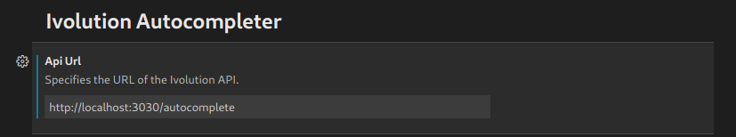

<h1 align="center"><p>Ivolution Autocompleter VS Code Plugin</p></h1>

[Ivolution Autocompleter](https://github.com/Ivolutionnow/ivolution-vscode) is an auto code completer based on OpenAI GPT-2. It is trained on a curated list of approximately 45K Python (~470MB) files gathered from the Github.

## Installation

The Plugin is not available yet on VS Code MarketPlace, but you can already easily install it using the .vsix file available on the project.

On the root folder of the project run the following command:

```sh
code --install-extension .\ivolution-autocompleter-plugin-0.0.1.vsix
```

If you want to generate a new .vsix file check [here](https://code.visualstudio.com/api/working-with-extensions/publishing-extension#packaging-extensions).

## Usage

With the extension installed, you should set the [Ivolution Autocompleter](https://github.com/Ivolutionnow/ivolution-vscode) API URL you want to use.

For setting the URL, just go to User Settings on your VSCode and search for Api Url.



When you open a Python file, the extension will be activated automatically.

Once you start coding, you only need to press `CTRL + Space` for getting the suggestions from Ivolution!
